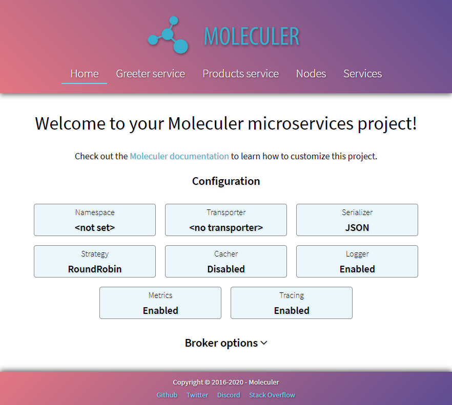

[](https://coveralls.io/github/moleculerjs/moleculer?branch=master)
[](https://codeclimate.com/github/moleculerjs/moleculer/maintainability)
[](https://www.codacy.com/gh/moleculerjs/moleculer/dashboard?utm_source=github.com&amp;utm_medium=referral&amp;utm_content=moleculerjs/moleculer&amp;utm_campaign=Badge_Grade)
[](https://snyk.io/test/github/moleculerjs/moleculer)
[](https://discord.gg/TSEcDRP)

[](https://www.npmjs.com/package/moleculer)
[](https://app.fossa.com/projects/git%2Bgithub.com%2Fmoleculerjs%2Fmoleculer?ref=badge_shield)
[][patreon]

# Moleculer [](https://www.npmjs.com/package/moleculer) [](https://twitter.com/intent/tweet?text=Moleculer%20is%20a%20modern%20microservices%20framework%20for%20Node.js&url=https://github.com/moleculerjs/moleculer&via=MoleculerJS&hashtags=nodejs,javascript,microservices)


Moleculer is a fast, modern and powerful microservices framework for [Node.js](https://nodejs.org/en/). It helps you to build efficient, reliable & scalable services. Moleculer provides many features for building and managing your microservices.
<!--


-->

**Website**: [https://moleculer.services](https://moleculer.services)

**Documentation**: [https://moleculer.services/docs](https://moleculer.services/docs)

# Top sponsors

<table style="text-align:center;"><tr>
    <td><a href="https://www.server-eye.de/" target="_blank"></a></td>
    <!--td><a href="https://sonderformat.llc/" target="_blank"></a></td-->
</tr></table>


# What's included

- Promise-based solution (async/await compatible)
- request-reply concept
- support event driven architecture with balancing
- built-in service registry & dynamic service discovery
- load balanced requests & events (round-robin, random, cpu-usage, latency, sharding)
- many fault tolerance features (Circuit Breaker, Bulkhead, Retry, Timeout, Fallback)
- plugin/middleware system
- support versioned services
- support [Stream](https://nodejs.org/dist/latest-v10.x/docs/api/stream.html)s
- service mixins
- built-in caching solution (Memory, MemoryLRU, Redis)
- pluggable loggers (Console, File, Pino, Bunyan, Winston, Debug, Datadog, Log4js)
- pluggable transporters (TCP, NATS, MQTT, Redis, NATS Streaming, Kafka, AMQP 0.9, AMQP 1.0)
- pluggable serializers (JSON, Avro, MsgPack, Protocol Buffer, Thrift, CBOR, Notepack)
- pluggable parameter validator
- multiple services on a node/server
- master-less architecture, all nodes are equal
- built-in parameter validation with [fastest-validator](https://github.com/icebob/fastest-validator)
- built-in metrics feature with reporters (Console, CSV, Datadog, Event, Prometheus, StatsD)
- built-in tracing feature with exporters (Console, Datadog, Event, Jaeger, Zipkin, NewRelic)
- official [API gateway](https://github.com/moleculerjs/moleculer-web), [Database access](https://github.com/moleculerjs/moleculer-db) and many other modules...

# Installation
```
$ npm i moleculer
```
or
```
$ yarn add moleculer
```

# Create your first microservice
This example shows you how to create a small service with an `add` action which can add two numbers and how to call it.
```js
const { ServiceBroker } = require("moleculer");

// Create a broker
const broker = new ServiceBroker();

// Create a service
broker.createService({
    name: "math",
    actions: {
        add(ctx) {
            return Number(ctx.params.a) + Number(ctx.params.b);
        }
    }
});

// Start broker
broker.start()
    // Call service
    .then(() => broker.call("math.add", { a: 5, b: 3 }))
    .then(res => console.log("5 + 3 =", res))
    .catch(err => console.error(`Error occurred! ${err.message}`));
```
[Try it in your browser](https://codesandbox.io/s/ky5lj09jv?fontsize=14)

# Create a Moleculer project
Use the Moleculer CLI tool to create a new Moleculer based microservices project.

1. Create a new project (named `moleculer-demo`)
    ```bash
    $ npx moleculer-cli -c moleculer init project moleculer-demo
    ```
    
2. Open the project folder
    ```bash
    $ cd moleculer-demo
    ```
    
3. Start the project
    ```bash
    $ npm run dev
    ```

4. Open the [http://localhost:3000/](http://localhost:3000/) link in your browser. It shows a welcome page that contains more information about your project & you can test the generated services.

:tada: **Congratulations! Your first Moleculer-based microservices project is created. Read our [documentation](https://moleculer.services/docs) to learn more about Moleculer.**



# Official modules
We have many official modules for Moleculer. [Check our list!](https://moleculer.services/modules.html)

# Supporting
Moleculer is an open source project. It is free to use for your personal or commercial projects. However, developing it takes up all our free time to make it better and better on a daily basis. If you like Moleculer framework, **[please support it](https://moleculer.services/support.html)**.

Thank you very much!

# For enterprise

Available as part of the Tidelift Subscription.

The maintainers of moleculer and thousands of other packages are working with Tidelift to deliver commercial support and maintenance for the open source dependencies you use to build your applications. Save time, reduce risk, and improve code health, while paying the maintainers of the exact dependencies you use. [Learn more.](https://tidelift.com/subscription/pkg/npm-moleculer?utm_source=npm-moleculer&utm_medium=referral&utm_campaign=enterprise&utm_term=repo)

# Documentation
You can find here [the documentation](https://moleculer.services/docs).

# Changelog
See [CHANGELOG.md](CHANGELOG.md).

# Security contact information
To report a security vulnerability, please use the [Tidelift security contact](https://tidelift.com/security).
Tidelift will coordinate the fix and disclosure.

# Contributions
We welcome you to join in the development of Moleculer. Please read our [contribution guide](http://moleculer.services/docs/contributing.html).
<a href="https://github.com/moleculerjs/moleculer/graphs/contributors"></a>

## Project activity


# License
Moleculer is available under the [MIT license](https://tldrlegal.com/license/mit-license).

[3rd party licenses](https://app.fossa.io/reports/09fc5b4f-d321-4f68-b859-8c61fe3eb6dc)

# Contact
Copyright (c) 2016-2022 MoleculerJS

[](https://github.com/moleculerjs) [](https://twitter.com/MoleculerJS)

[patreon]: https://www.patreon.com/bePatron?u=6245171
