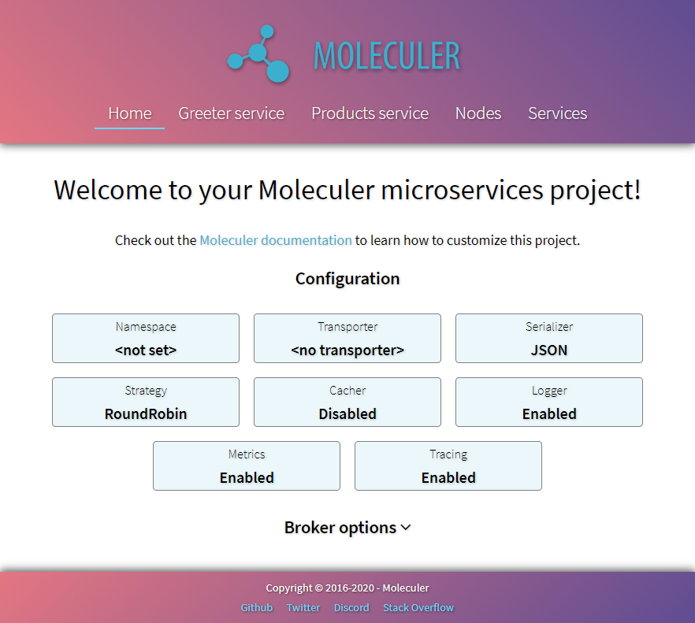

[](https://coveralls.io/github/moleculerjs/moleculer?branch=master)
[](https://codeclimate.com/github/moleculerjs/moleculer/maintainability)
[](https://www.codacy.com/gh/moleculerjs/moleculer/dashboard?utm_source=github.com&amp;utm_medium=referral&amp;utm_content=moleculerjs/moleculer&amp;utm_campaign=Badge_Grade)
[](https://snyk.io/test/github/moleculerjs/moleculer)
[](https://discord.gg/TSEcDRP)
[](https://gurubase.io/g/moleculer)

[](https://www.npmjs.com/package/moleculer)
[][patreon]

# Moleculer [](https://www.npmjs.com/package/moleculer) [](https://twitter.com/intent/tweet?text=Moleculer%20is%20a%20modern%20microservices%20framework%20for%20Node.js&url=https://github.com/moleculerjs/moleculer&via=MoleculerJS&hashtags=nodejs,javascript,microservices)


Moleculer is a fast, modern and powerful microservices framework for [Node.js](https://nodejs.org/en/). It helps you to build efficient, reliable & scalable services. Moleculer provides many features for building and managing your microservices.
<!--


-->

**Website**: [https://moleculer.services](https://moleculer.services)

**Documentation**: [https://moleculer.services/docs](https://moleculer.services/docs)

# Why Moleculer?

Moleculer gives you the distributed-systems layer as part of the framework, so you don't have to run a platform to get it:

- **No orchestrator required.** Nodes find each other over the transporter (NATS, Redis, Kafka, MQTT, AMQP — or plain TCP with no broker at all). Service discovery is a built-in registry, not Consul, etcd or a service mesh.
- **Scale by starting another process.** Every broker balances requests and events across the instances it can see (round-robin, random, CPU-usage, latency, sharding) with zero configuration.
- **Fault tolerance is a broker option.** Timeout, retry, circuit breaker, bulkhead and fallback are configuration, not five more dependencies.
- **The same code from one process to many.** Start as a modular monolith (`transporter: null`), split later by moving services to another process — the service code and the `broker.call()` sites stay the same.
- **Batteries included, and pluggable.** Caching, parameter validation, metrics, tracing, serializers, loggers and middlewares all ship with it, and all of them can be swapped.


# Top sponsors

<table style="text-align:center;"><tr>
    <td><a href="https://www.servereye.de/" target="_blank"></a></td>
    <!--td><a href="https://sonderformat.llc/" target="_blank"></a></td-->
</tr></table>


# What's included

- Promise-based solution (async/await compatible)
- request-reply concept
- support event driven architecture with balancing
- built-in service registry & dynamic service discovery
- load balanced requests & events (round-robin, random, cpu-usage, latency, sharding)
- many fault tolerance features (Circuit Breaker, Bulkhead, Retry, Timeout, Fallback)
- plugin/middleware system
- support versioned services
- support [Streams](https://nodejs.org/docs/latest/api/stream.html)
- service mixins
- built-in caching solution (Memory, MemoryLRU, Redis)
- pluggable loggers (Console, File, Pino, Bunyan, Winston, Debug, Datadog, Log4js)
- pluggable transporters (TCP, NATS, MQTT, Redis, Kafka, AMQP 0.9, AMQP 1.0)
- pluggable serializers (JSON, JSONExt, MsgPack, CBOR, Notepack)
- pluggable parameter validator
- multiple services on a node/server
- master-less architecture, all nodes are equal
- built-in parameter validation with [fastest-validator](https://github.com/icebob/fastest-validator)
- built-in metrics feature with reporters (Console, CSV, Datadog, Event, Prometheus, StatsD)
- built-in tracing feature with exporters (Console, Datadog, Event, Jaeger, Zipkin, NewRelic)
- official [API gateway](https://github.com/moleculerjs/moleculer-web), [Database access](https://github.com/moleculerjs/moleculer-db) and many other modules...

# Installation
```
$ npm i moleculer
```
or
```
$ yarn add moleculer
```

# Create your first microservice
This example shows you how to create a small service with an `add` action which can add two numbers and how to call it.
```js
const { ServiceBroker } = require("moleculer");

// Create a broker
const broker = new ServiceBroker();

// Create a service
broker.createService({
    name: "math",
    actions: {
        add(ctx) {
            return Number(ctx.params.a) + Number(ctx.params.b);
        }
    }
});

// Start broker
broker.start()
    // Call service
    .then(() => broker.call("math.add", { a: 5, b: 3 }))
    .then(res => console.log("5 + 3 =", res))
    .catch(err => console.error(`Error occurred! ${err.message}`));
```
[Try it in your browser](https://codesandbox.io/s/ky5lj09jv?fontsize=14)

# Scale it to another process
The interesting part is what happens when that service moves to its own process. Add a transporter, start the same file twice, and call it from a third process — no addresses to configure, no registry to run.

```js
// node.js — the same service, now on its own node
const { ServiceBroker } = require("moleculer");

const broker = new ServiceBroker({
    nodeID: process.argv[2],
    transporter: "nats://localhost:4222"
});

broker.createService({
    name: "math",
    actions: {
        add(ctx) {
            return { result: Number(ctx.params.a) + Number(ctx.params.b), from: broker.nodeID };
        }
    }
});

broker.start();
```

```js
// client.js — it only knows the action name
const { ServiceBroker } = require("moleculer");

const broker = new ServiceBroker({ nodeID: "client", transporter: "nats://localhost:4222" });

broker.start()
    .then(() => broker.waitForServices("math"))
    .then(async () => {
        for (let i = 0; i < 4; i++)
            console.log(await broker.call("math.add", { a: 5, b: 3 }));
        await broker.stop();
    });
```

```
$ node node.js node-1 &
$ node node.js node-2 &
$ node client.js
{ result: 8, from: 'node-1' }
{ result: 8, from: 'node-2' }
{ result: 8, from: 'node-1' }
{ result: 8, from: 'node-2' }
```

Stop one of the nodes and the calls keep working: the registry notices, and the surviving instance takes the traffic.


# Create a Moleculer project
Use the Moleculer CLI tool to create a new Moleculer based microservices project.

1. Create a new project (named `moleculer-demo`)
    ```bash
    $ npx moleculer-cli -c moleculer init project moleculer-demo
    ```
    
2. Open the project folder
    ```bash
    $ cd moleculer-demo
    ```
    
3. Start the project
    ```bash
    $ npm run dev
    ```

4. Open the [http://localhost:3000/](http://localhost:3000/) link in your browser. It shows a welcome page that contains more information about your project & you can test the generated services.

:tada: **Congratulations! Your first Moleculer-based microservices project is created. Read our [documentation](https://moleculer.services/docs) to learn more about Moleculer.**




# Examples
The [moleculer-examples](https://github.com/moleculerjs/moleculer-examples) repository contains runnable projects, each with its own README and a `run.sh` that reproduces the whole demo:

- [Microservices without Kubernetes](https://github.com/moleculerjs/moleculer-examples/tree/master/01-microservices-without-kubernetes) — one process → many processes → scaling a copy, with a `moleculer-web` gateway and a docker-compose deployment
- [Moleculer vs NestJS](https://github.com/moleculerjs/moleculer-examples/tree/master/02-moleculer-vs-nestjs) — the same service in both frameworks, side by side
- [TypeScript](https://github.com/moleculerjs/moleculer-examples/tree/master/03-typescript) — shared contract file, schema style and class style, typed caller
- [From a modular monolith to microservices](https://github.com/moleculerjs/moleculer-examples/tree/master/04-monolith-to-microservices) — extracting services in three stages
- [Service discovery and load balancing](https://github.com/moleculerjs/moleculer-examples/tree/master/05-service-discovery-and-load-balancing) — scaling and crashes with traffic running, balancing strategies, TCP transporter
- [Circuit breaker, retry and timeout](https://github.com/moleculerjs/moleculer-examples/tree/master/06-circuit-breaker-retry-timeout) — the fault-tolerance features against a deliberately flaky service
- [Event-driven pub/sub](https://github.com/moleculerjs/moleculer-examples/tree/master/07-event-driven-pubsub) — emit vs broadcast, groups, the same code on NATS, Redis and Kafka, durable channels
- [Moleculer vs gRPC vs tRPC](https://github.com/moleculerjs/moleculer-examples/tree/master/08-moleculer-vs-grpc-trpc) — an RPC protocol compared with a service layer, and how to combine them

Plus two full applications: a [blog site](https://github.com/moleculerjs/moleculer-examples/tree/master/blog) and the [RealWorld](https://github.com/moleculerjs/moleculer-examples/tree/master/conduit) backend.

# Official modules
We have many official modules for Moleculer. [Check our list!](https://moleculer.services/modules.html)

# Supporting
Moleculer is an open source project. It is free to use for your personal or commercial projects. However, developing it takes up all our free time to make it better and better on a daily basis. If you like Moleculer framework, **[please support it](https://moleculer.services/support.html)**.

Thank you very much!

# For enterprise

Available as part of the Tidelift Subscription.

The maintainers of moleculer and thousands of other packages are working with Tidelift to deliver commercial support and maintenance for the open source dependencies you use to build your applications. Save time, reduce risk, and improve code health, while paying the maintainers of the exact dependencies you use. [Learn more.](https://tidelift.com/subscription/pkg/npm-moleculer?utm_source=npm-moleculer&utm_medium=referral&utm_campaign=enterprise&utm_term=repo)

# Documentation
You can find here [the documentation](https://moleculer.services/docs).

# Changelog
See [CHANGELOG.md](CHANGELOG.md).

# Security contact information
To report a security vulnerability, please use the [Tidelift security contact](https://tidelift.com/security).
Tidelift will coordinate the fix and disclosure.

# Contributions
We welcome you to join in the development of Moleculer. Please read our [contribution guide](http://moleculer.services/docs/contributing.html).
<a href="https://github.com/moleculerjs/moleculer/graphs/contributors"></a>

## Project activity


# License
Moleculer is available under the [MIT license](https://tldrlegal.com/license/mit-license).

# Contact
Copyright (c) 2016-2026 MoleculerJS

[](https://github.com/moleculerjs) [](https://twitter.com/MoleculerJS)

[patreon]: https://www.patreon.com/bePatron?u=6245171
